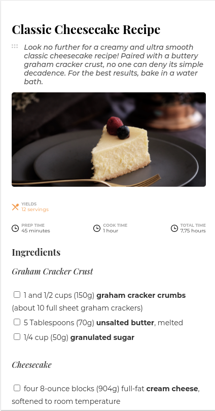

<!-- Please update value in the {}  -->

<h1 align="center">Recipe Page</h1>

<div align="center">
   Solution for a challenge from  <a href="http://devchallenges.io" target="_blank">Devchallenges.io</a>.
</div>

<div align="center">
  <h3>
    <a href="https://plucky-cover.surge.sh/">
      Demo
    </a>
    <span> | </span>
    <a href="https://github.com/brandovidal/recipe-page">
      Solution
    </a>
    <span> | </span>
    <a href="https://devchallenges.io/challenges/OEKdUZ6xs0h99C38XVht">
      Challenge
    </a>
  </h3>
</div>

<!-- TABLE OF CONTENTS -->

## Table of Contents

- [Table of Contents](#table-of-contents)
- [Overview](#overview)
  - [Built With](#built-with)
- [Features](#features)
- [How To Use](#how-to-use)
- [Acknowledgements](#acknowledgements)
- [Contact](#contact)

<!-- OVERVIEW -->

## Overview

_Screenshot Laptop_


_Screenshot Mobile_



Introduce your projects by taking a screenshot or a gif. Try to tell visitors a story about your project by answering:

Introduce your projects by taking a screenshot or a gif. Try to tell visitors a story about your project by answering:

- Where can I see your demo?
  [Live demo](https://plucky-cover.surge.sh)

- What was your experience?
  I feel gratifying to be able to solve this challenge.

- What have you learned/improved?
  Website layout and responsive design.

- Your wisdom? :)

### Built With

<!-- This section should list any major frameworks that you built your project using. Here are a few examples.-->

- [HTML5](https://html5.org/)
- [CSS](https://developer.mozilla.org/es/docs/Web/CSS)
- [Surge](https://surge.sh/)

## Features

<!-- List the features of your application or follow the template. Don't share the figma file here :) -->

This application/site was created as a submission to a [DevChallenges](https://devchallenges.io/challenges) challenge. The [challenge](https://devchallenges.io/challenges/TtUjDt19eIHxNQ4n5jps) was to build an application to complete the following user stories:

- [x] User story: This is a completed user stories

## How To Use

To clone and run this application, you'll need [Git](https://git-scm.com) and [Node.js](https://nodejs.org/en/download/) (which comes with [npm](http://npmjs.com)) installed on your computer. From your command line:

```bash
# Clone this repository
$ git clone https://github.com/brandovidal/recipe-page

# Install dependencies
$ npm run install

# Run the app
$ npm run dev

# Deploy app
$ npm run build

# preview deploy
$ npm run preview
```

## Acknowledgements

<!-- This section should list any articles or add-ons/plugins that helps you to complete the project. This is optional but it will help you in the future. For exmpale -->

- [Steps to replicate a design with only HTML and CSS](https://devchallenges-blogs.web.app/how-to-replicate-design/)
- [Node.js](https://nodejs.org/)
- [Marked - a markdown parser](https://github.com/chjj/marked)

## Contact

- GitHub [@brandovidal](https://github.com/brandovidal)
- Twitter [@brandovidal](https://twitter.com/_brandovidal)
